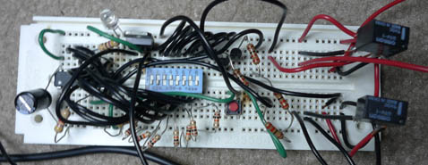
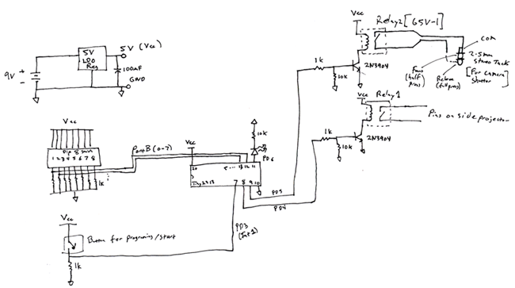
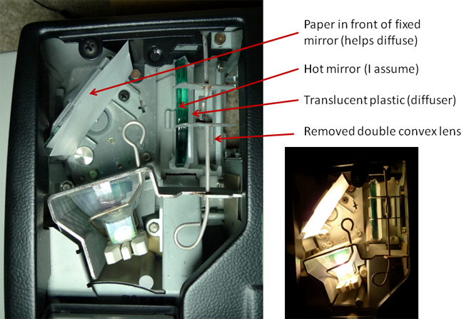
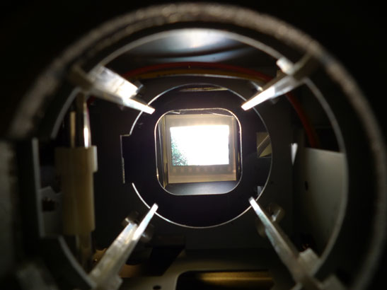

### Simple Rapid Slide Digitizer - Extra Details

I have had a few people ask me about the details of this project. I'm happy to provide them however, given that you will need to know how to do inline programming on the AVR AT2313 you probably already know some way to design the required circuits. 

On the slide projector, well it was chosen at random and modified in an ad hock manner. You might get the same projector as they *are* common but there is no explicit reason to use the one I did (Ektagraphic II).  

*Normal disclaimer applies: these designs are provided without any warranty. Build this project at your own risk, short a high voltage to your cable release and you could blow up your camera for instance. Projectors have line voltages in them, etc.*  

Someone asked what the breadboard looked like, here it is: 
             

If you can make much of that I congratulate you :-) it is a mess.    

So here is a more complete schematic. The values for the resistors are arbitrary. I did not re-check what I used but the values listed would work, click for a large version:

Relay 1 is connected to the DIN connector on the pack of the slide projector. I just used two bent nails of the correct size as the pins to plug in. One pin goes into COMon and the other into the FWD. I didn't use back but it is the pin I labeled I believe.

The other relay plugs into a 2.5 mm mini stereo jack. As indicated in the schematic the tip of this jack on a Canon SLR is equal to a full shutter press (release). The middle is equal to a half shutter press (focus). The bottom is the COMon. 

That is it for the circuit.

The firmware ([download](./slidedigitizer/autoslide.c)) basically does the following. When you push the button the Tiny2313 reads PortB. If pin 8 is logic-0 then it uses the value of PortB as the number of slides that need to be copied (max 127, a carousel holds only 80). If it is logic-1 then pins 6 and 7 tell what delay to program and the lower bits set that delay. The times are relay 1 on time, relay 1 off time, relay 2 on time, relay 2 off time. On running, the code does the actions in order. That is only one relay can ever be on at once. The firmware blinks the LED twice to confirm writing timing values to the EEPROM. While running the LED remains on steady.

Now onto the projector...

I didn't know what to expect from the projector but it turned out to be really easy. The front focusing lens just comes out with a pull. The rest of the optical system is just under a hatch with a bulb. I removed a double convex lens and added paper in front of the mirror act as a diffuser. This wasn't quite enough diffusion. So I taped a piece of translucent HDPE from a box I had to what I believe is a hot mirror, which I left in the projector. You may use a nicer glass diffuser if you wish but old hand held slide viewers and my slide scanner basically use a translucent plastic diffuser as well. You can see what it looks like below, the plastic is more obvious with the bulb on:

Finally here is the view from the front:

You position the lens so that it sees the slide and a black border for cropping in case the slide doesn't fall in the exact same spot each time.
